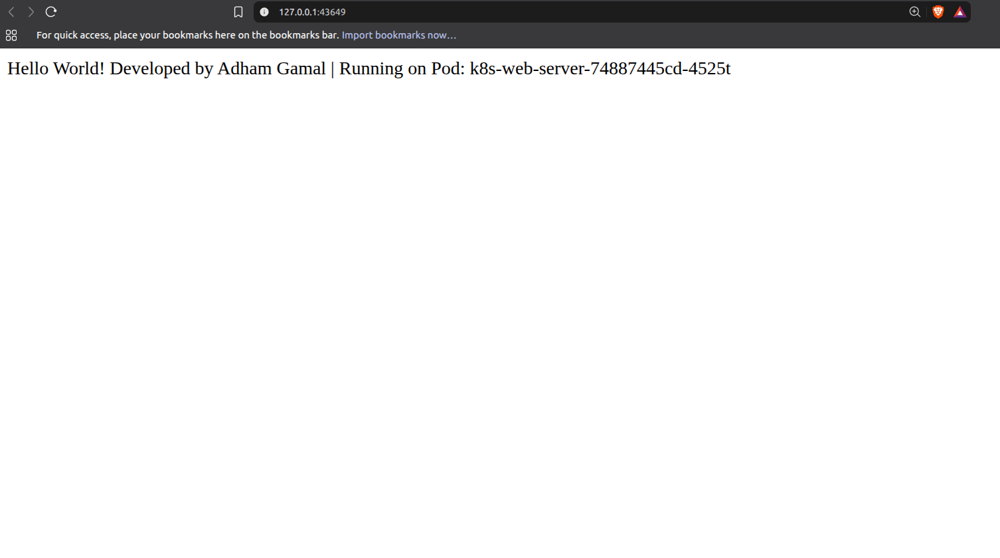
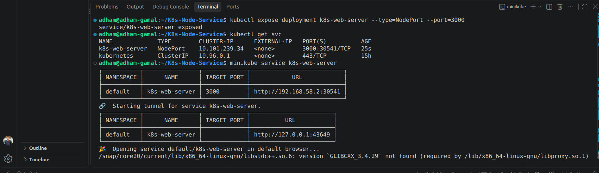

# 🚀 K8s Node Service

A simple Node.js (Express) web server, containerized with Docker, published to Docker Hub, and deployed on a local Kubernetes cluster with Minikube.

## Tech Stack

Node.js · Express · Docker · Kubernetes (Minikube)

## Project Structure

```
K8s-Node-Service/
├── images/            # Screenshots used in this README
├── Dockerfile         # Container image definition
├── index.mjs          # Express server (port 3000)
├── package.json
└── package-lock.json
```

## Run Locally

```bash
npm install
npm start
```

Open `http://localhost:3000`.

## Docker

```bash
# Build
docker build -t adhamgamal74/k8s-web-server .

# Run
docker run -p 3000:3000 adhamgamal74/k8s-web-server

# Push to Docker Hub
docker login
docker push adhamgamal74/k8s-web-server:latest
```

## Deploy to Kubernetes (Minikube)

```bash
# Start the cluster
minikube start --driver=docker

# Create the deployment from the Docker Hub image
kubectl create deployment k8s-web-server --image=adhamgamal74/k8s-web-server

# Expose it outside the cluster
kubectl expose deployment k8s-web-server --type=NodePort --port=3000

# Open it in the browser
minikube service k8s-web-server
```

### Scale

```bash
kubectl scale deployment k8s-web-server --replicas=5
kubectl get pods -o wide
```

### Clean up

```bash
kubectl delete service k8s-web-server
kubectl delete deployment k8s-web-server
```

## Screenshots

**Service response**



**Terminal**



## Author

**Adham Gamal** — [GitHub](https://github.com/adhamgamal22) · [LinkedIn](https://linkedin.com/in/adhamgamal74)
